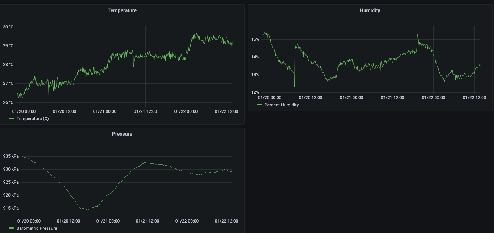

# Enviro+API
 This is a hacked together flask API for reading data from the [Pimoroni Enviro+
pHat](https://shop.pimoroni.com/products/enviro).

## History
I saw this hat on [adafruit](https://www.adafruit.com/) and thought it looked
cool, so I bought one.  I like graphs, so I decided to build a dashboard and
alerting system for the metrics available from this hat using the TICK
stack.  I built this simple API for pulling data into [influxdb](https://www.influxdata.com/)
and then graphing with [grafana](https://grafana.com/).



## Why?
LOL, I have no idea, this just sounded fun.  I guess I could configure it to
send me a slack message if my house was on fire?

## Installation and setup.
It is assumed that you have already installed the [Pimoroni library for the
device](https://github.com/pimoroni/enviroplus-python) and have successfully
run all the examples, with the exception of the particulate matter and
luftdaten ones.  I do not own the separate particulate matter sensor, so I have
not tested or used it.  I also have not tried contributing data to luftdaten;
that was not a goal of my project.  I honestly found Pimoroni's setup
instructions lacking, but I was able to work through the errors I encountered
until it worked.


```
virtualenv -p python3 enviroplusapi
source enviroplusapi/bin/activate
pip install -r requirements.txt
```

## Usage
```./run.sh```
